# Object Detection System - Activity Diagram

```mermaid
flowchart TD
    Start([Start]) --> CheckInit{Is Initialized?}
    
    CheckInit -->|No| LoadModel[Load TFLite Model]
    LoadModel --> LoadLabels[Load Labels from labelmap.txt]
    LoadLabels --> AllocateTensors[Allocate Tensors]
    AllocateTensors --> SetInit[Set Initialized = true]
    SetInit --> CheckInterpreter
    
    CheckInit -->|Yes| CheckInterpreter{Interpreter Valid?}
    CheckInterpreter -->|No| ReturnEmpty([Return Empty List])
    
    CheckInterpreter -->|Yes| GetTensorInfo[Get Input/Output Tensor Info]
    GetTensorInfo --> Preprocess[Preprocess Image]
    Preprocess --> Resize[Resize to 640x640]
    
    Resize --> CheckType{Input Type?}
    CheckType -->|Float32| PrepFloat[Prepare Float32 Input<br/>Normalize 0-1]
    CheckType -->|Uint8| PrepUint[Prepare Uint8 Input<br/>Keep 0-255]
    
    PrepFloat --> RunInference[Run Model Inference]
    PrepUint --> RunInference
    
    RunInference --> ParseOutput[Parse YOLO Output<br/>84 x 8400 tensor]
    
    ParseOutput --> DetectFormat{Detect Coordinate Format}
    DetectFormat -->|Normalized 0-1| UseNorm[Use Normalized Coords]
    DetectFormat -->|Pixel 0-640| UsePixel[Convert to Normalized]
    
    UseNorm --> LoopDetections
    UsePixel --> LoopDetections
    
    LoopDetections[Loop Through 8400 Detections] --> GetBox[Get Bounding Box<br/>x, y, w, h]
    GetBox --> FindClasses[Find Best 2 Classes]
    FindClasses --> CheckThreshold{Confidence >= Threshold?}
    
    CheckThreshold -->|No| NextDetection
    CheckThreshold -->|Yes| ValidateBox{Valid Box Size?<br/>30x30 min, aspect ratio}
    
    ValidateBox -->|No| NextDetection
    ValidateBox -->|Yes| ConvertCoords[Convert to Image Coordinates]
    
    ConvertCoords --> AddDetection[Add to Detections List]
    AddDetection --> NextDetection{More Detections?}
    
    NextDetection -->|Yes| GetBox
    NextDetection -->|No| ApplyNMS[Apply Non-Maximum Suppression<br/>IoU Threshold 0.45]
    
    ApplyNMS --> SortByConf[Sort by Confidence]
    SortByConf --> SuppressOverlap[Suppress Overlapping Boxes]
    SuppressOverlap --> TakeTop5[Take Top 5 Results]
    
    TakeTop5 --> ReturnResults([Return Detection Results])
```

## Component Details

### Initialization Phase
- Loads YOLOv8n TFLite model from assets
- Parses 80 COCO class labels
- Configures 4 threads for inference

### Preprocessing Phase
- Minimal preprocessing to match training distribution
- Resizes image to 640x640 (model input size)
- Handles both NCHW and NHWC tensor formats

### Inference Phase
- Runs YOLOv8 model inference
- Output shape: [1, 84, 8400]
  - 84 = 4 box coords + 80 class probabilities
  - 8400 = detection anchors

### Post-processing Phase
- Filters by confidence threshold (0.25 default)
- Validates bounding box dimensions
- Applies NMS to remove duplicate detections
- Returns top 5 highest confidence results
